# Property-Prices-in-Hong-Kong
Analyzing Property Transaction Prices in Hong Kong in Python

# Data source
The hw.csv file contains Property Transaction price of Kowloon between Nov 2014 to Nov 2020. The data was extracted from the "District Latest Deals" from https://data.28hse.com/en/

# Jupiter notebook:
https://github.com/trajceskijovan/Property-Prices-in-Hong-Kong/blob/main/Property%20Transaction%20Prices%20in%20Hong%20Kong.ipynb

# Task:
1. Import and clean data
2. Merge datasets
3. Data Aggregation
4. Data Vizualization
5. Modeling
6. Data Insights

# Insights:
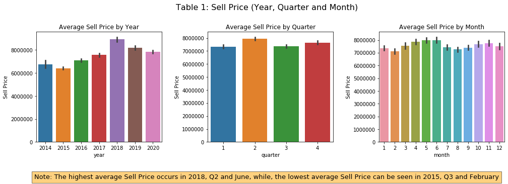

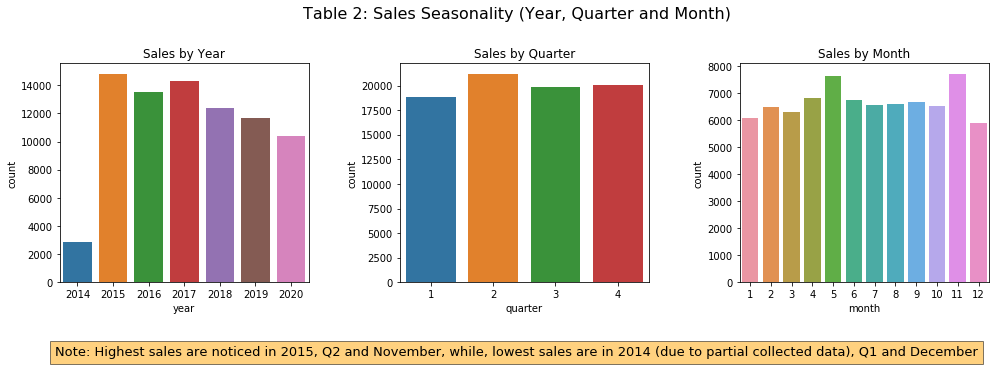

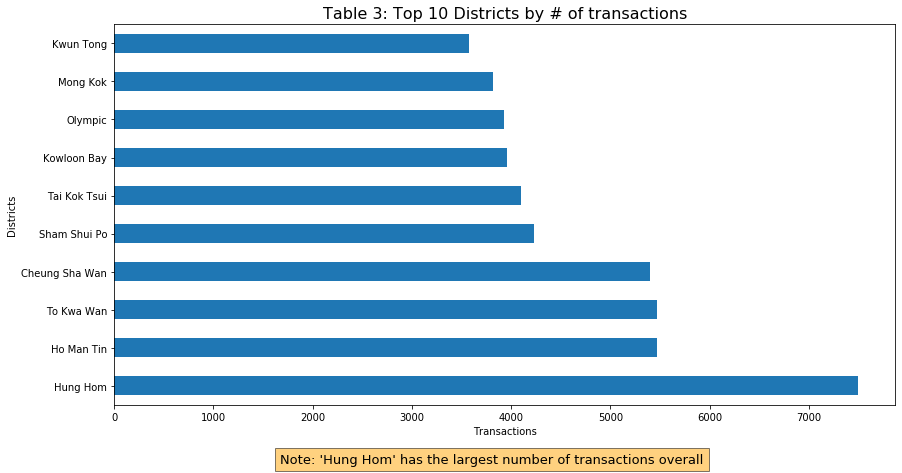

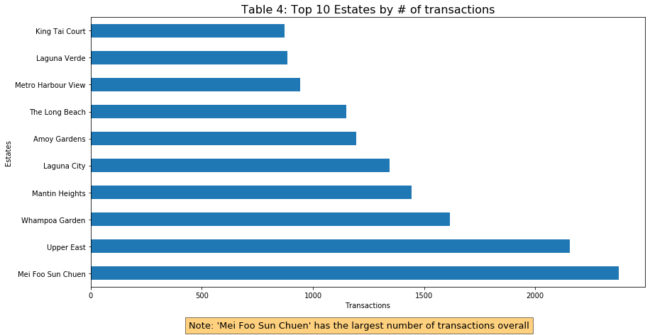

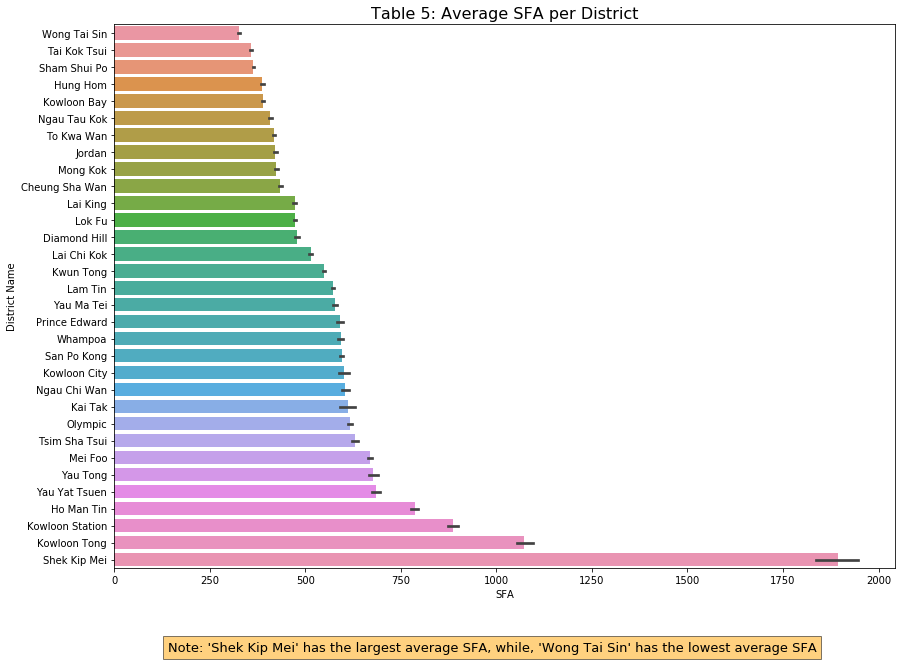

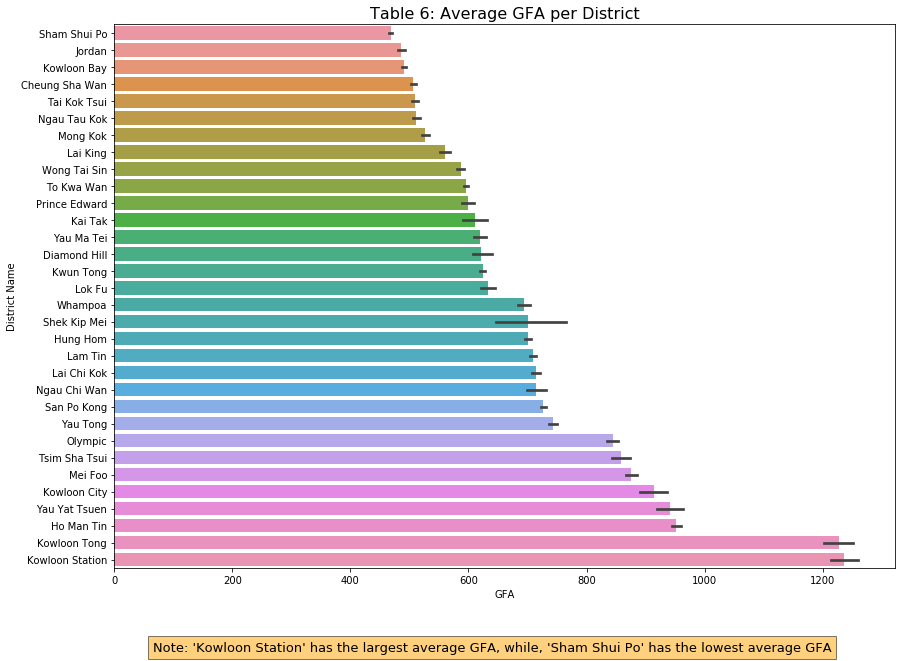

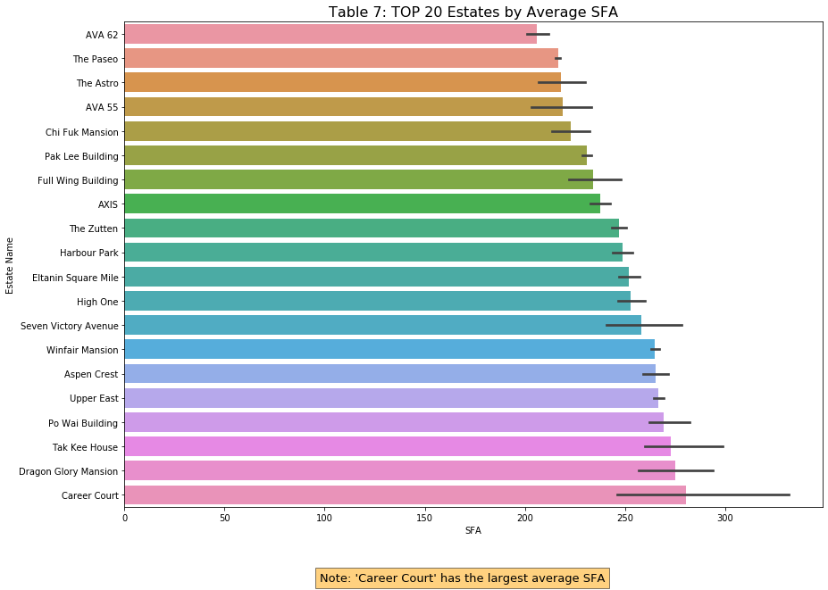

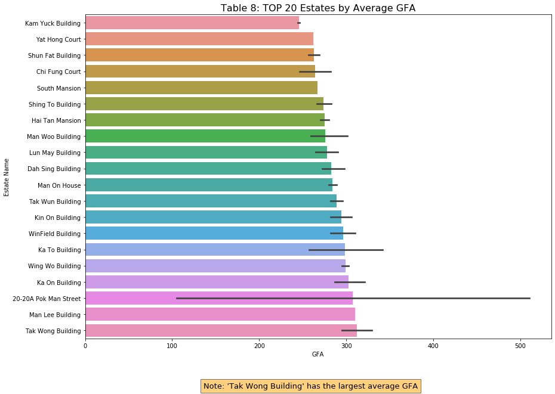

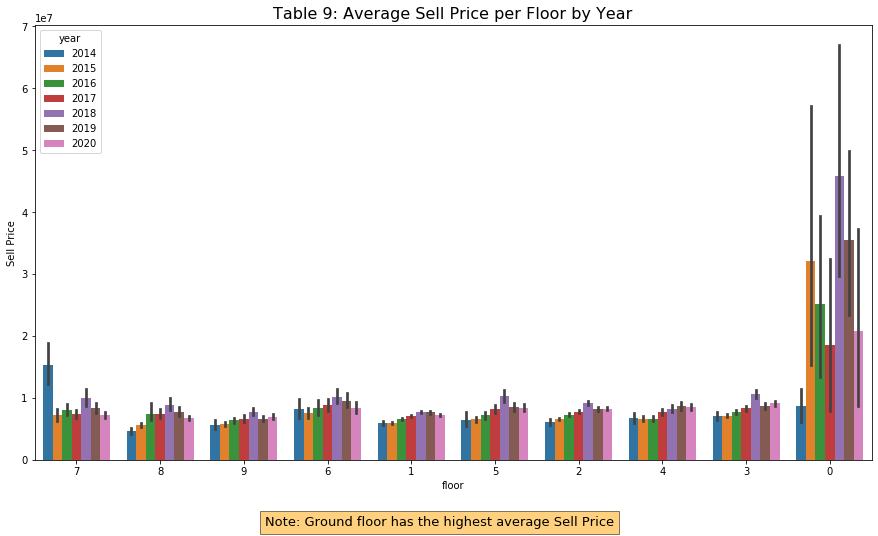

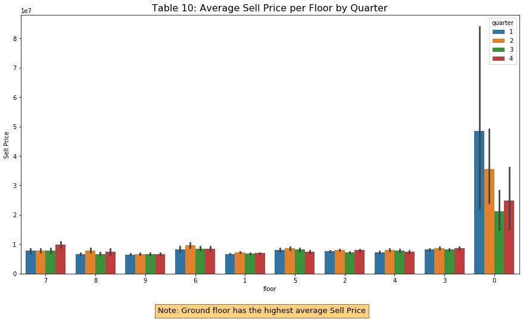

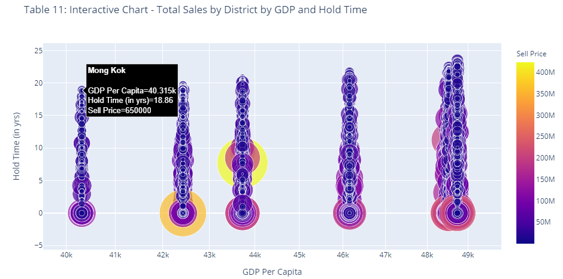

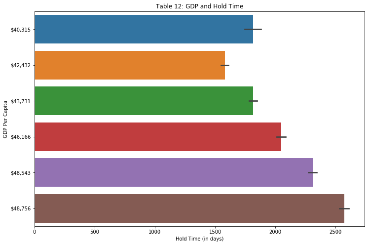

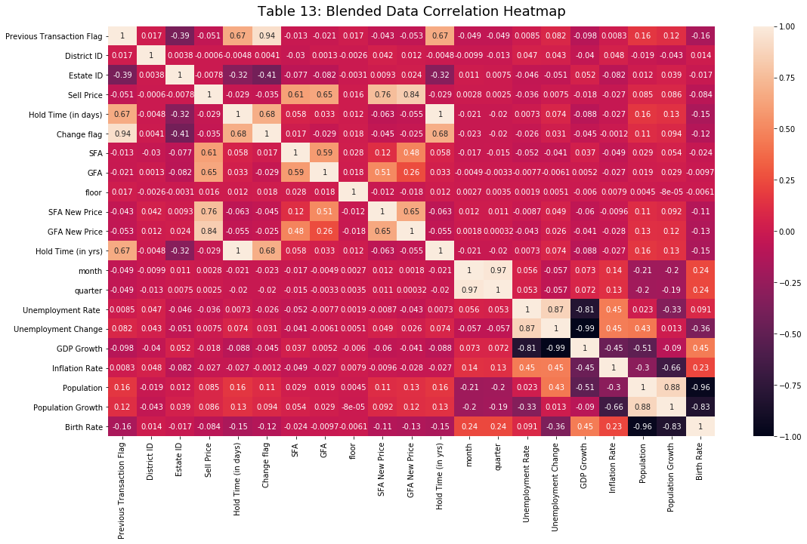

---
This code is free to use for academic purposes only, provided that a proper reference is cited. This code comes without technical support of any kind. Under no circumstances will the author be held responsible for any use of this code in any way.
